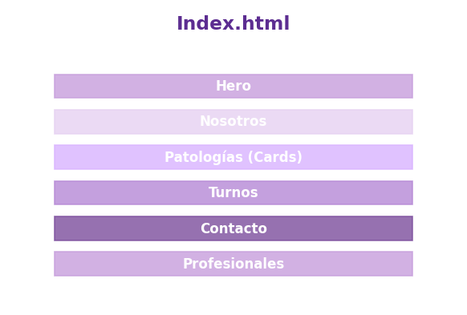
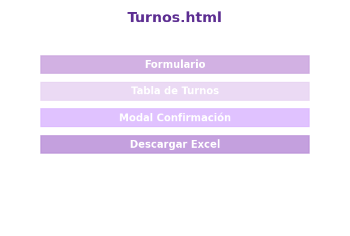
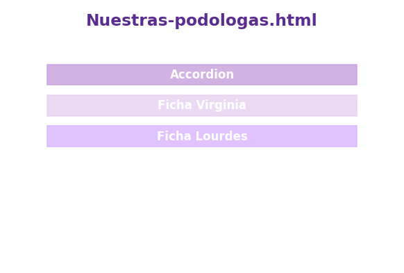

# 🌿 TIPS Podología

Proyecto web desarrollado como **2da pre-entrega** para la materia de Diseño y Maquetado Web.  
El sitio representa la clínica **TIPS Podología**, mostrando información institucional, servicios, profesionales y un sistema de turnos.

---

## 📌 Estructura del proyecto

El proyecto está compuesto por **3 páginas HTML** más su hoja de estilos y recursos:

- **index.html** → Página principal, con secciones de inicio, nosotros, patologías tratadas, turnos, contacto y profesionales.  
- **turnos.html** → Agenda interactiva de turnos, con formulario de reservas, tabla dinámica y exportación a Excel. Incluye un **modal de Bootstrap** para confirmar la reserva.  
- **nuestras-podologas.html** → Página con ficha de profesionales presentada mediante un **accordion de Bootstrap**.  
- **style.css** → Estilos personalizados, utilizando **flexbox** y **grid** para la maquetación responsive.  
- **medios/** → Carpeta con imágenes y recursos visuales.

---

## 🖥️ Tecnologías utilizadas

- **HTML5** + **CSS3**  
- **Flexbox** y **CSS Grid** (maquetado responsive).  
- **Bootstrap 5.3** (navbar, accordion, modal, tabla responsive).  
- **JavaScript Vanilla** (validación de formulario y lógica de turnos).  
- **XLSX.js** para exportar turnos a Excel.  

---

## 📱 Responsividad

El proyecto cumple con el requisito de **maquetado responsive**:  
- En **desktop**, se utilizan layouts en grid y flex con múltiples columnas.  
- En **mobile**, los elementos se reorganizan en una sola columna, mejorando la legibilidad y usabilidad.  

Ejemplos:  
- `index.html` → Sección de patologías con **cards en grid adaptable**.  
- `nuestras-podologas.html` → **Accordion Bootstrap** para mejor navegación en pantallas chicas.  
- `turnos.html` → Formulario 100% adaptable + **tabla responsive**.

---

## 🚀 Despliegue

El proyecto se encuentra disponible en **GitHub Pages**:  
👉 [Ver sitio en línea](https://TU_USUARIO.github.io/tips-podologia/)  

Repositorio público en GitHub:  
👉 [Repositorio del proyecto](https://github.com/TU_USUARIO/tips-podologia)

---

## 👩‍⚕️ Equipo profesional representado

- **María Virginia Morichetti** – Técnica en Podología (MP 324).  
- **Lourdes Jaquelina Ledesma** – Técnica en Podología (FBCB UNL).  

---

## 📸 Capturas de pantalla

  
  
  

---

## ✨ Autoría

- Proyecto desarrollado por **Brito, Juan Cruz**.  
- Año académico: **2025**.  
